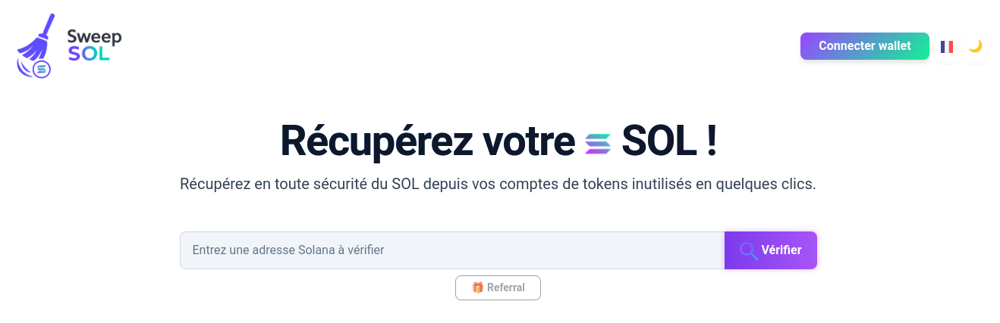

# SweepSOL

<figure><figcaption></figcaption></figure>

**What is SweepSOL?**

SweepSOL is a tool designed to help Solana users reclaim SOL locked in unused or empty token accounts. When interacting with tokens on Solana—such as through airdrops, faucets, or platforms like Pump.fun, Raydium, or Bullx—Associated Token Accounts (ATAs) are automatically created. These accounts require a small amount of SOL to maintain, and when left unused, they can lock up valuable funds.

<figure><figcaption></figcaption></figure>

**How SweepSOL Works**

SweepSOL scans your wallet for these empty token accounts and helps you close them securely. By doing so, it instantly returns the locked SOL to your wallet. This process is easy, safe, and efficient, allowing you to claim your SOL, clean up your wallet, and recover resources without hassle.

<figure><figcaption></figcaption></figure>

**Benefits and Features**

Whether you're looking to claim free SOL, sweep unused accounts, or simply optimize your wallet, SweepSOL makes the process fast, secure, and effortless. With SweepSOL, you can easily manage your Solana assets, ensuring that no SOL is unnecessarily locked away in inactive accounts.

Website: [https://sweepsol.com](https://sweepsol.com)

